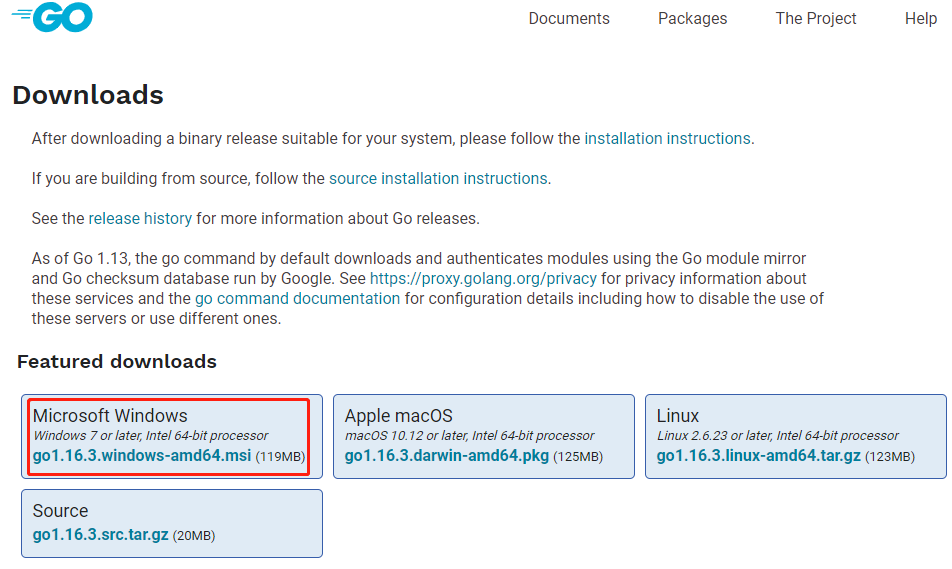
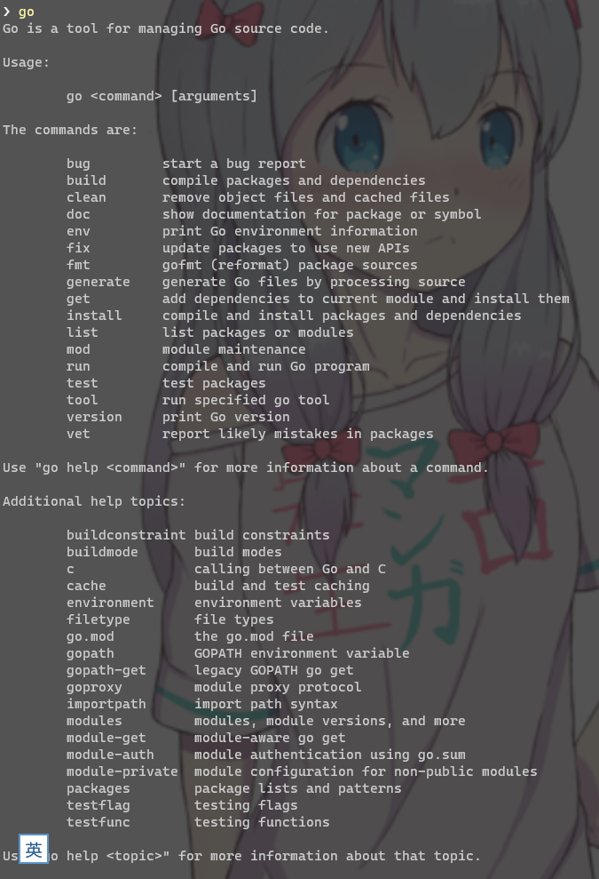
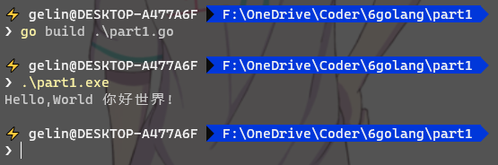

# Go 开发环境搭建

[toc]

## Golang安装
Golang的安装特别简单，在官网下载对应平台的安装包后傻瓜式安装即可。

下载地址：https://golang.org/dl/

安装完毕Golang后，Golang会自动的将自身可执行文件添加到系统的环境变量中，可以运行go来验证。

  
  

## Golang开发IDE安装

基本主流的编辑器IDE都支持Golang开发，  

比如：Sublime、Atom、VSCode、VIM....等等，个人还是喜欢巨硬的VSCode。  

  

## 第一个GO版“你好世界”代码

代码：

```go
package main
import "fmt"

func main(){
    fmt.Println("Hello,World 你好世界！");
}
```


命令：

```bash
go run     xxx.go #运行go文件，这个其实好像是会将go文件临时编译到某个地方，然后再运行可执行程序，不像py真正的运行编译
go build   xxx.go #编译go源码，将go源码编译成一个可执行文件，在Windows上编译成.exe
go install xxx.go #这个好像有点忘记了，大概是大项目的时候用的？能把package什么的都包含进去编译？
```
  

