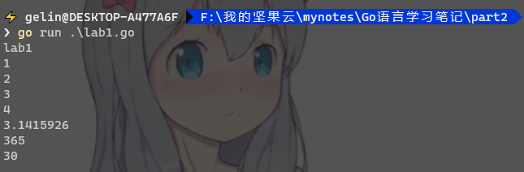

# Go 基础知识

## 程序包名

Go中每个文件是个包，可以理解成C++的类文件，只不过没有C++的头文件。

Go中每个文件必须要有`package`，每个go程序必须要有`package main`，每个main package必须要有`func main`。

也就是说一个go 程序如果没有package main，和func main，那么这个go程序他是不知道入口点在哪的。

```go
package main
```

## 导入包

每个语言都会导入三方的SDK，包含三方的类或包。

其他语言

```bash
#include <hack.h> #C/C++头文件
#import <hack.h>  #OC语法
import hack       #python
package com.java.hack #java
```

Go语言

```go
import "hack" //go语言 有点类似python和java导入包名
```
```go
//还有一种简写方法,写Go基本都用这种方法
import (
    "hack"
    "fmt"
    "io"  //这种方法就可以省略很多句import
)
```
### 别名：
```go
import (
        //stdio "fmt" //可以取别名
        . "fmt" //可以省略掉包名
)
func main(){
        //如果是别名
        stdio.Println("你好part2!");
        //如果是.
        Println("你好part2!");
}
```

## 声明

```go
const PI = 3.1415926  //常量 这个C/C++的常量一样，用const来修饰
var name = "VxerLee"  //全局变量,写在func 外面
type newType int      //一般类型,相当于给int 取个别名一样
type Student strucct{}//结构体
type iTools interface{}//接口
```

## Private、Public

Go语言中，使用大小写来决`常量、变量、类型、接口、结构或函数`是否可以被外部包所调用：

根据约定，函数名首字母`小写`即为Private，函数名`大写`即为Public


## 课后作业：

既然导入多个包时可以就行简写，那么声明多个常量、全局变量或一般类型（非接口、非结构）是否可以可以用同样的方法呢？

请手动验证。


### 验证：

经过验证是可以的，秒啊！

```go
package main
import (
        "fmt"
)
var (
        var1 = 1
        var2 = 2
        var3 = 3
        var4 = 4
)
const (
        PI = 3.1415926
        YEAR = 365
        MONTH = 30
)
func main(){
        fmt.Println("lab1");
        fmt.Println(var1);
        fmt.Println(var2);
        fmt.Println(var3);
        fmt.Println(var4);
        fmt.Println(PI);
        fmt.Println(YEAR);
        fmt.Println(MONTH);
}
```

  